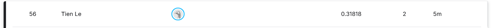

# CSE 144 Final Project

## Transfer Learning Challenge



Instructions for generating "submissions.csv"
--
1. Clone this repo (https://github.com/tcle103/cse144-final). Make sure Python >=3.9.0 is installed on your computer.
0. Open “final.ipynb”. Uncomment the above specified line if you’re running in a clean environment.
0. Run all code cells in order. Do not run the cell beginning with “# phase 1 training - train classifier head only” twice; if execution stops or you need to restart training, restart the whole kernel to reproduce results.
0. The last cell should evaluate and write “submission.csv” into a folder in the root directory called “out”.
0. That’s it!

Running inference and training individually
--
To just run training, run all the cells up until and including the one that begins with
```
# phase 1 training - train classifier head only
```
Only run this cell once - if you need to run it again, restart the kernel to get the same results!
<br><br>
To just run inference, run all the cells from after (excluding) the cell beginning with
```
# phase 1 training - train classifier head only
```
This will generate "submissions.csv" from the previously generated model weights saved to "root/out/best_classifierhead_only.pt" - if you have not run the training, this will be the same weights as the ones submitted.

Saved weights
--
Google link to model weights: <br>
To use, put in "root/out" and name "best_classifier_head_only.pt", if not already named so.
